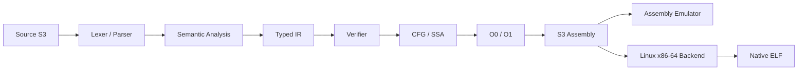

# S3

[](https://github.com/SamDevlab/S3/actions/workflows/tests.yml)

**S3 é uma linguagem experimental de sistemas baseada em ternário balanceado**, desenvolvida para explorar semântica explícita, execução determinística, verificação forte do pipeline e um caminho nativo Linux x86-64.

O projeto não é apenas um parser ou transpiler: ele possui frontend de compilador, análise semântica, IR tipada, CFG/SSA, verifier, otimizações, Assembly própria, emulador e backend nativo.

> O compilador de referência é implementado em Python. Os executáveis nativos gerados pelo S3 não dependem de Python para executar.

## Visão em 30 segundos



### O que já existe

- `trit` e `tryte` balanceados;
- `i64` checked e `f64` IEEE-754;
- funções, recursão, loops e `match`;
- arrays com bounds checking;
- records e enums nominais;
- módulos com imports/exports explícitos;
- referências seguras `&T` e `&mut T`;
- CFG, dominância e SSA;
- IR e Assembly verificáveis;
- otimizações conservadoras;
- emulador;
- backend Linux x86-64 / System V AMD64;
- differential testing e CI multi-versão de Python.

## Por que este projeto existe

S3 é um laboratório de engenharia de linguagens. O objetivo é estudar como decisões de representação, verificação e lowering podem tornar o comportamento de uma linguagem mais explícito e auditável.

Três princípios guiam o projeto:

1. **correção antes de performance** — otimização não pode alterar comportamento observável;
2. **semântica explícita** — operações importantes têm contratos próprios em vez de depender de transformações implícitas frágeis;
3. **evidência end-to-end** — uma capacidade só é considerada pronta quando parser, semântica, IR, Assembly, emulação e backend aplicável demonstram o mesmo contrato.

## Estado e versionamento

O pacote publicável continua sendo **`s3-bootstrap` 0.7.0**.

A linha interna **1.x** evolui o compilador, a linguagem e o runtime, mas a existência de código ou de uma milestone não implica automaticamente uma nova release pública.

## Tipos numéricos

### `trit` e `tryte`

Os tipos ternários balanceados permanecem parte central da linguagem. A introdução de tipos de máquina não redefine a semântica ternária histórica.

### `i64`

Inteiro assinado de 64 bits com operações checked:

```text
+ - * / unary-
== != < <= > >=
```

Overflow, divisão por zero e `INT64_MIN / -1` não fazem wrap silencioso.

A subtração de máquina usa uma operação tipada própria (`NUMERIC_DIFFERENCE` / `TNDIFF`) para evitar overflow intermediário artificial em casos válidos.

### `f64`

Segue IEEE-754 binary64. Na geração nativa x86-64, operações floating-point usam SSE2/XMM e participam do ABI interno System V AMD64.

### Conversões explícitas

```text
to_i64(trit|tryte) -> i64
to_f64(trit|tryte|i64) -> f64
to_tryte(i64) -> tryte
```

`to_tryte(i64)` verifica a faixa balanceada `[-364, 364]`.

Não existem casts referência ↔ inteiro.

## Referências e memória

S3 possui referências tipadas:

```text
&T
&mut T
```

O modelo atual evita:

- null references;
- raw pointers;
- pointer arithmetic;
- casts referência ↔ inteiro.

`&mut` representa capacidade de escrita, sem prometer automaticamente o mesmo modelo de exclusividade/noalias de Rust.

A implementação cobre storage local, elementos de arrays, campos de records e reborrow, preservando proveniência no compilador.

## Exemplo

```s3
fn score(logp: f64, mw: f64, aromatic: f64, tpsa: f64) -> f64:
    return -3.0 + logp * -0.35 + (mw / 100.0) * -0.2 + aromatic * -0.4 + (tpsa / 50.0) * 0.15

fn main() -> trit:
    mut counter: i64 = 0
    while counter < 1000000:
        counter = counter + 1

    return (counter == 1000000) & (score(2.0, 300.0, 2.0, 50.0) < -4.54)
```

## Otimização e verificação

O pipeline inclui:

- CFG e dominância;
- SSA e verificação por passes;
- constant propagation / folding;
- DCE;
- contratos de efeitos de memória e proveniência;
- differential testing;
- serialização determinística;
- register allocation GPR experimental no backend nativo.

A regra central é simples: **otimização nunca deve mudar a semântica observável do programa**.

## Backend nativo

Target principal: **Linux x86-64**.

O backend gera GNU Assembly e usa `cc`, `gcc` ou `clang` para montar e linkar o ELF.

```bash
s3 native-asm examples/first.s3 -o build/first.s
s3 build examples/first.s3 -o build/first
s3 run-native examples/first.s3
```

## Instalação

```bash
python -m venv .venv
```

PowerShell:

```powershell
.venv\Scripts\Activate.ps1
```

Linux/macOS:

```bash
source .venv/bin/activate
```

Instalação:

```bash
python -m pip install .
s3 --help
s3 run examples/first.s3
```

Para desenvolvimento:

```bash
python -m pip install -e ".[dev]"
python -m pytest
```

## CLI

```bash
s3 targets
s3 doctor
s3 check examples/first.s3
s3 inspect examples/first.s3
s3 inspect examples/first.s3 --emit ir
s3 inspect examples/first.s3 --emit assembly
s3 tokens examples/static_array.s3
s3 ast examples/static_array.s3
s3 ir examples/static_array.s3
s3 verify-ir build/array.s3ir.json
s3 asm examples/first.s3 -O1
s3 run examples/static_array.s3
s3 build examples/first.s3 -o build/first
s3 run-native examples/first.s3 -O1
```

## Testes e CI

Categorias da suíte:

```text
s3_fast
s3_contract
s3_differential
s3_native
s3_slow
s3_benchmark
```

Execução local:

```bash
python -m pytest
python tools/golden_inspect.py check
```

A CI cobre Python 3.11, 3.12 e 3.13 e inclui gates separados para execução nativa, SSA, diferencial determinístico, goldens e benchmark smoke.

Benchmarks são caracterização; **correção e equivalência são gates**.

## Self-hosting

O projeto possui uma linha incremental de self-hosting e renderer Assembly escrito em S3.

Python continua sendo a implementação de referência. Um componente só substitui o caminho de referência quando equivalência e cobertura suficiente demonstram que a migração é segura.

## Roadmap arquitetural

```text
NUMERIC
  ↓
SLICES
  ↓
FFI
  ↓
DYNAMIC
  ↓
HOST_SERVICES
  ↓
PROJECT_CONTAINER_MODEL
  ↓
S3_DOCKER
```

Milestones associadas:

```text
1.32  Numeric Domains & Large Indexing
1.33  Borrowed Slices & Large Contiguous Buffers
1.34  Foreign ABI, Library Mode & Zero-Copy Host Interop
1.35  Owned Dynamic Runtime Data
1.36  Linux Host Services & Foreign Tool Interop
1.37  S3 Project & Container-Native Application Model
1.38  S3 Docker V1
```

## Interoperabilidade

A direção do projeto inclui:

- C ABI como fronteira de interoperabilidade;
- bibliotecas S3 carregáveis por hosts externos;
- buffers contíguos e zero-copy;
- integração com Python/C/C++/Rust por ABI;
- processos, arquivos e pipes;
- Docker/OCI como camada de compatibilidade;
- GPU inicialmente por providers maduros antes de um backend próprio.

Essas capacidades só devem ser tratadas como públicas após seus respectivos gates.

## Limitações atuais

S3 ainda é experimental e não deve ser apresentado como linguagem de produção geral.

Limitações importantes:

- sem raw pointers, null ou pointer arithmetic;
- sem garbage collector;
- sem generics gerais;
- sem concorrência madura de linguagem;
- sem backend completo para Windows, macOS ou ARM64;
- sem JIT;
- self-hosting ainda incremental.

## Estrutura do repositório

```text
bootstrap/s3/    frontend, IR, verifier, Assembly, emuladores e backends
spec/            especificações e contratos normativos
docs/            milestones e documentação técnica
docs/decisions/  decisões arquiteturais
examples/        programas e fixtures oficiais
tests/           regressão, contratos, diferencial, nativo e benchmarks
selfhost/        evolução Python → S3
stdlib/          biblioteca padrão em evolução
```

## Documentação

- [`docs/roadmap.md`](docs/roadmap.md) — roadmap geral;
- [`spec/`](spec/) — especificações normativas;
- [`docs/decisions/`](docs/decisions/) — decisões arquiteturais;
- [`docs/releases/0.7.0.md`](docs/releases/0.7.0.md) — release público 0.7.0.

## Licença

Apache-2.0.
