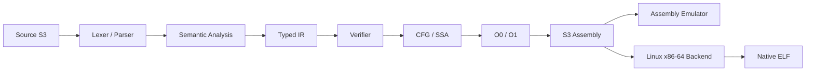

# S3

[](https://github.com/SamDevlab/S3/actions/workflows/tests.yml)

**S3 é uma linguagem experimental de sistemas baseada em ternário balanceado**, criada para explorar semântica explícita, execução determinística, verificação forte do pipeline e geração nativa Linux x86-64.

> A release estável atual é **S3 v1.0.0**. O compilador de referência é implementado em Python; programas nativos gerados pelo S3 não dependem de Python para executar.

## Pipeline



## Estado estável

```text
GitHub release          v1.0.0
Python distribution     s3-bootstrap 1.0.0
Source syntax default   0.6
IR JSON                 0.6.0
S3 Assembly             0.6.0
Diagnostic schema       1.0.0
Reference compiler      Python
Primary native target   Linux x86-64
Full self-hosting       Deferred research
PyPI                    Not published
```

A release `v1.0.0` foi congelada e certificada antes da publicação com um T4 full-lineage de `393/393`, além de matriz Python 3.11/3.12/3.13 e certificação Linux x86-64. Os detalhes ficam em [`docs/releases/1.0.0.md`](docs/releases/1.0.0.md) e nos relatórios de estabilização.

## Capacidades principais

- `trit` e `tryte` balanceados;
- `i64` checked e `f64` IEEE-754;
- funções, recursão, loops e `match`;
- arrays com bounds checking;
- records e enums nominais;
- módulos com imports/exports explícitos;
- referências tipadas `&T` e `&mut T`;
- IR tipada, CFG, dominância e SSA;
- verifier e serialização determinística;
- otimizações O1 conservadoras;
- S3 Assembly e emulador;
- backend Linux x86-64 / System V AMD64;
- differential testing e gates nativos.

## Princípios

1. **Correção antes de performance** — otimização não pode alterar comportamento observável.
2. **Semântica explícita** — operações importantes possuem contratos próprios.
3. **Evidência end-to-end** — capacidades são promovidas apenas quando frontend, IR, verifier e backends aplicáveis demonstram o mesmo contrato.
4. **Fail closed** — caminhos não certificados ou providers indisponíveis não devem virar sucesso implícito.

## Tipos numéricos

### `trit` e `tryte`

Os tipos ternários balanceados permanecem centrais à linguagem. Um `tryte` possui seis trits e representa valores de `-364` a `364`.

### `i64`

Inteiro assinado de 64 bits com operações checked. Overflow, divisão por zero e `INT64_MIN / -1` não fazem wrap silencioso.

### `f64`

Segue IEEE-754 binary64. No backend x86-64, operações floating-point usam SSE2/XMM dentro do contrato nativo certificado.

### Conversões explícitas

```text
to_i64(trit|tryte) -> i64
to_f64(trit|tryte|i64) -> f64
to_tryte(i64) -> tryte
```

Não existem casts referência ↔ inteiro.

## Referências e memória

S3 possui referências tipadas:

```text
&T
&mut T
```

O modelo evita null references, raw pointers, pointer arithmetic e casts referência ↔ inteiro. `&mut` representa capacidade de escrita sem prometer automaticamente o mesmo modelo de exclusividade/noalias de Rust.

## Exemplo

```s3
fn score(logp: f64, mw: f64, aromatic: f64, tpsa: f64) -> f64:
    return -3.0 + logp * -0.35 + (mw / 100.0) * -0.2 + aromatic * -0.4 + (tpsa / 50.0) * 0.15

fn main() -> trit:
    mut counter: i64 = 0
    while counter < 1000000:
        counter = counter + 1

    return (counter == 1000000) & (score(2.0, 300.0, 2.0, 50.0) < -4.54)
```

## Instalação

O pacote ainda **não está publicado no PyPI**. Para usar a versão estável a partir do repositório:

```bash
git clone https://github.com/SamDevlab/S3.git
cd S3
git checkout v1.0.0
python -m venv .venv
```

Linux/macOS:

```bash
source .venv/bin/activate
python -m pip install .
```

PowerShell:

```powershell
.venv\Scripts\Activate.ps1
python -m pip install .
```

Depois:

```bash
s3 --help
s3 check examples/first.s3
s3 run examples/first.s3
```

Para desenvolvimento no `main`:

```bash
python -m pip install -e ".[dev]"
python -m pytest
python tools/golden_inspect.py check
```

## CLI

```bash
s3 targets
s3 doctor
s3 check examples/first.s3
s3 inspect examples/first.s3
s3 inspect examples/first.s3 --emit ir
s3 inspect examples/first.s3 --emit assembly
s3 tokens examples/static_array.s3
s3 ast examples/static_array.s3
s3 ir examples/static_array.s3
s3 verify-ir build/array.s3ir.json
s3 asm examples/first.s3 -O1
s3 run examples/static_array.s3
s3 build examples/first.s3 -o build/first
s3 run-native examples/first.s3 -O1
```

## Testes e certificação

Categorias principais:

```text
s3_fast
s3_contract
s3_differential
s3_native
s3_slow
s3_benchmark
```

A matriz do projeto cobre Python 3.11, 3.12 e 3.13, além de gates para SSA, diferencial determinístico, goldens, benchmark smoke e Linux x86-64 nativo.

Benchmarks são caracterização; **correção e equivalência são gates**.

## Backend nativo

O target nativo principal certificado é **Linux x86-64**. O backend gera GNU Assembly e usa `cc`, `gcc` ou `clang` para montar e linkar ELF.

```bash
s3 native-asm examples/first.s3 -o build/first.s
s3 build examples/first.s3 -o build/first
s3 run-native examples/first.s3
```

Outros targets só devem ser tratados como suportados quando houver evidência de execução correspondente.

## Self-hosting

O repositório preserva componentes experimentais escritos em S3, mas **full compiler self-hosting está fora do caminho crítico**. Python continua sendo o compilador de referência e default.

Uma futura retomada exige primeiro uma arquitetura genérica completa — `source -> lexer -> parser -> AST/HIR -> semantics -> IR -> verifier -> emitter -> compile_program` — e os gates de reentrada documentados em [`docs/selfhost/REENTRY_CRITERIA.md`](docs/selfhost/REENTRY_CRITERIA.md).

Veja também [`docs/selfhost/STATUS.md`](docs/selfhost/STATUS.md) e [`docs/selfhost/FUTURE_ARCHITECTURE.md`](docs/selfhost/FUTURE_ARCHITECTURE.md).

## Roadmap pós-1.0

O estado atual do projeto fica em [`docs/roadmap/ACTIVE_TRACK.md`](docs/roadmap/ACTIVE_TRACK.md). A linha pós-1.0 prioriza manutenção, confiabilidade e seleção explícita de objetivos antes de iniciar novos grandes trains.

O primeiro objetivo proposto para a linha 1.1 é **Reliability & Maintenance**: fuzzing/differential testing determinístico, watchdog real por subprocesso, reprodução/minimização de falhas e reforço da base estável antes de novas expansões de linguagem.

## Limitações atuais

S3 ainda é experimental e não deve ser apresentado como linguagem de produção geral.

Limitações relevantes:

- sem raw pointers, null ou pointer arithmetic;
- sem garbage collector;
- sem generics gerais;
- sem concorrência madura de linguagem;
- sem backend completo certificado para Windows, macOS ou ARM64;
- sem JIT;
- full self-hosting não concluído;
- PyPI ainda não publicado.

## Estrutura do repositório

```text
bootstrap/s3/    frontend, IR, verifier, Assembly, emuladores e backends
spec/            especificações e contratos normativos
docs/            milestones, decisões e documentação técnica
examples/        programas e fixtures oficiais
tests/           regressão, contratos, diferencial, nativo e benchmarks
selfhost/        pesquisa e componentes S3 escritos para diferencial/bootstrap
stdlib/          biblioteca padrão em evolução
```

## Documentação

- [`docs/releases/1.0.0.md`](docs/releases/1.0.0.md) — release estável atual;
- [`docs/roadmap/ACTIVE_TRACK.md`](docs/roadmap/ACTIVE_TRACK.md) — estado operacional atual;
- [`docs/roadmap.md`](docs/roadmap.md) — histórico amplo do roadmap;
- [`spec/`](spec/) — especificações normativas;
- [`docs/decisions/`](docs/decisions/) — decisões arquiteturais;
- [`docs/selfhost/STATUS.md`](docs/selfhost/STATUS.md) — política atual de self-hosting.

## Licença

Apache-2.0.
